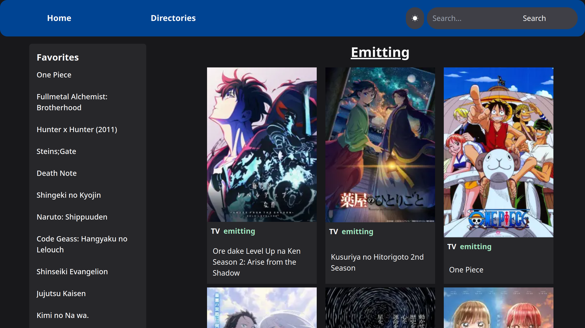
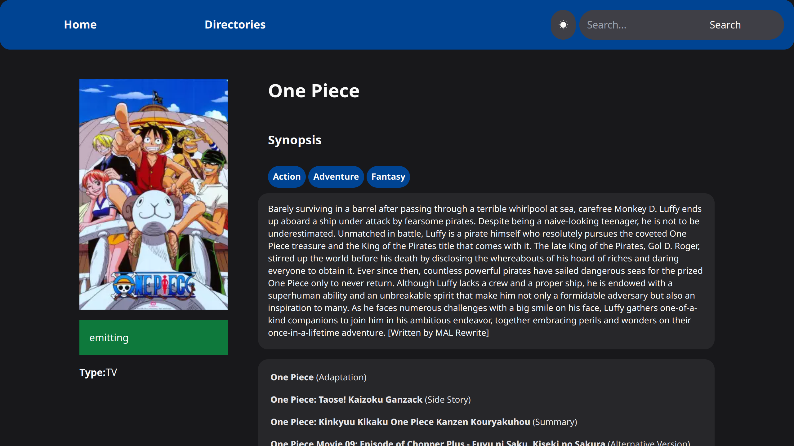
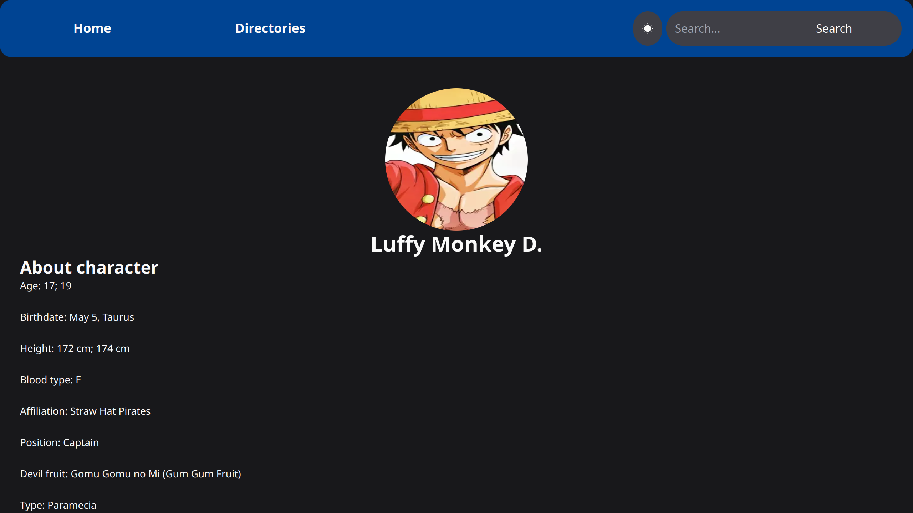

# Datanime

> Un buscador de animes interactivo construido con Next.js, NextUI y TailwindCSS, conectado a la API de Jikan para obtener información en tiempo real sobre tus animes favoritos.

## 🚀 Tecnologías Utilizadas

- **Next.js** - Framework de React para aplicaciones web rápidas y eficientes.
- **NextUI** - Componentes estilizados para una mejor experiencia de usuario.
- **TailwindCSS** - Framework de estilos para un diseño moderno y responsivo.
- **Jikan API** - Fuente de datos para información detallada sobre animes y mangas.

## 📌 Características

✅ **Página principal**: Muestra animes que están en emisión y los favoritos del momento.
✅ **Directorio de animes**: Permite filtrar animes según diferentes criterios.
✅ **Tarjetas de animes**: Cada anime se muestra con su título, estado e imagen.
✅ **Detalles del anime**: Al hacer clic en un anime, se muestra información detallada junto con sus personajes.
✅ **Tarjetas de personajes**: Al hacer clic en un personaje, se despliega una tarjeta con su información.
✅ **Interfaz moderna** y adaptable con NextUI y TailwindCSS.

## 📸 Capturas de Pantalla





## 🛠 Instalación y Uso

1. Clonar el repositorio:
   ```sh
   git clone https://github.com/Hernan-Hernandezz/datanime.git
   cd datanime
   ```
2. Instalar dependencias:
   ```sh
   pnpm install
   ```
3. Ejecutar el proyecto en desarrollo:
   ```sh
   pnpm dev
   ```
4. Abrir en el navegador:
   ```sh
   http://localhost:3000
   ```

## 📜 Licencia

Este proyecto está bajo la licencia MIT. ¡Siéntete libre de usarlo y mejorarlo!

---

💡 **Contribuciones y feedback son bienvenidos.** ¡Si te gusta el proyecto, no olvides darle una ⭐ en GitHub!
